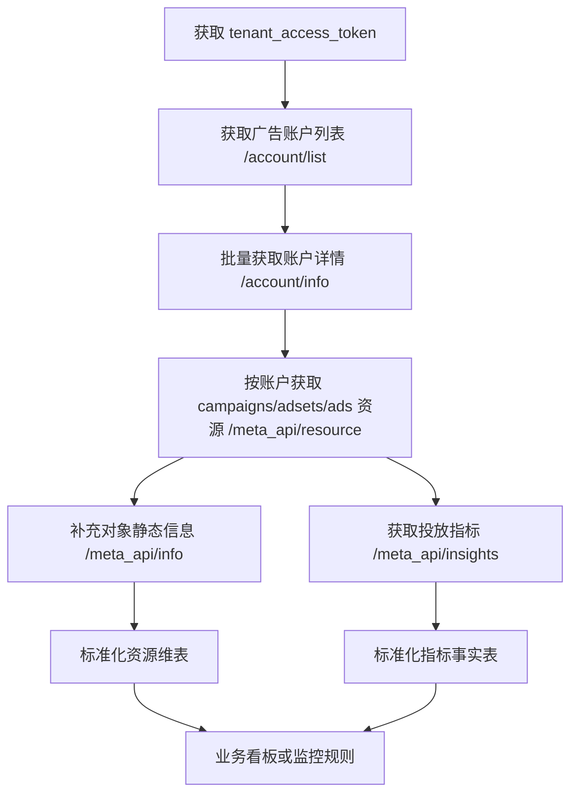

# Facebook 广告数据 API 接入信息文档

> 文档整理日期：2026-06-04  
> 主要来源：YinoLink Apifox 开放 API 网关、YinoCloud API Key 操作说明、Meta Marketing API 官方字段说明入口。  
> 说明：飞书 Wiki 待确认内容已由用户提供的 `YinoCloud——API Key操作说明.docx` 补全。

## 1. 目标

通过 YinoLink 开放 API 获取 Facebook/Meta 广告账户、广告系列、广告组、广告、素材/内容信息及广告投放效果指标，并整理为可落库、可展示的标准数据结构。

目标展示字段包括但不限于：

| 中文字段 | 建议来源 | 说明 |
| --- | --- | --- |
| 广告账户 | account/list、account/info、insights | 账户 ID、账户名称、时区、余额、状态等 |
| 广告系列 | meta_api/resource、meta_api/info、insights | campaign id/name/status/objective/budget 等 |
| 广告组 | meta_api/resource、meta_api/info、insights | adset id/name/status/budget/optimization_goal/targeting 等 |
| 广告 | meta_api/resource、meta_api/info、insights | ad id/name/status/creative 等 |
| 投放 | meta_api/resource、meta_api/info | 建议取 effective_status/status/configured_status |
| 操作/成效动作 | insights.actions | 需要按 action_type 拆分 |
| 预算 | meta_api/info | campaign/adset 的 daily_budget、lifetime_budget、budget_remaining 等 |
| 已花费金额 | insights.spend | 按日期、广告层级聚合 |
| 单次点击费用(全部) | insights.cpc | Meta CPC(all) |
| 成效 | insights.actions 或 results | 建议按业务目标选择 action_type 后派生 |
| 单次成效费用 | insights.cost_per_action_type 或 spend / 成效 | 与“成效”使用同一 action_type |
| 加入购物车次数 | insights.actions | add_to_cart 相关 action_type |
| 结账发起次数 | insights.actions | initiate_checkout 相关 action_type |
| 广告花费回报(ROAS) | insights.purchase_roas / website_purchase_roas / action_values | 需确认口径 |
| 点击率(全部) | insights.ctr | CTR(all) |
| 点击量(全部) | insights.clicks | Clicks(all) |
| 覆盖人数 | insights.reach | Reach |
| 展示次数 | insights.impressions | Impressions |

## 2. 接入基础信息

### 2.1 正式环境

```text
https://yl-open-api-lfnsrvbmgm.ap-northeast-1.fcapp.run
```

### 2.2 认证方式

除获取 token 接口外，其他接口均使用 Bearer Token：

```http
Authorization: Bearer <tenant_access_token>
```

YC 后台显示字段与 API 入参对应关系：

| YC 显示字段 | API 字段 |
| --- | --- |
| 应用 ID | client_id |
| API Key | client_secret |

应用必须先在 YinoCloud 审核通过，才会展示应用 ID 和 API Key。待审核状态下这两个字段为空，不能进行接口调用。

### 2.3 Token 获取

```http
POST /api/v1/auth/tenant_access_token/internal
Content-Type: multipart/form-data
```

请求参数：

| 参数 | 必填 | 类型 | 说明 |
| --- | --- | --- | --- |
| client_id | 是 | string | 应用 ID |
| client_secret | 是 | string | API Key |

返回核心字段：

| 字段 | 类型 | 说明 |
| --- | --- | --- |
| data.tenant_access_token | string | 后续请求使用的 token |
| data.expires_in | integer | 剩余有效期，单位通常为秒 |
| data.token_type | string | token 类型 |
| data.scope | string | 权限范围 |

注意事项：

1. tenant_access_token 最大有效期为 2 小时。
2. 剩余有效期小于 30 分钟时，重新调用会返回一个新 token，旧 token 会同时保持有效一段时间。
3. 剩余有效期大于等于 30 分钟时，重新调用会返回原 token。
4. 建议缓存 token，不要每次业务请求前重复获取。

curl 示例：

```bash
curl --location --request POST \
  'https://yl-open-api-lfnsrvbmgm.ap-northeast-1.fcapp.run/api/v1/auth/tenant_access_token/internal' \
  --form 'client_id="<client_id>"' \
  --form 'client_secret="<client_secret>"'
```

### 2.4 全局响应结构

常见响应结构：

```json
{
  "code": 200,
  "msg": "success",
  "data": {},
  "request_id": "1762416297896777000-5132355990777054879"
}
```

全局错误码：

| code | 说明 |
| --- | --- |
| 200 | 成功 |
| 201 | 参数错误 |
| 202 | 资源不存在 |
| 203 | 系统内部错误 |
| 204 | 业务流程错误 |
| 401 | 未授权访问 |
| 429 | 达到请求限制 |

### 2.5 YinoCloud API Key 申请与管理

API Key 服务入口：

```text
https://yinocloud.yinolink.com/api_manage
```

适用场景：如果公司具备开发能力，希望在自己的软件中管理 Facebook 广告账户，并进行账户充值、清零、广告数据分析等操作，可以在 YinoCloud 申请 API Key 服务。

进入路径：

1. 左侧菜单栏进入 `企业管理` -> `API Key管理`。
2. 或点击右上角头像，在下拉菜单中选择 `API Key管理`。
3. 在 API Key 管理页面点击 `创建应用`，进入申请 API Key 服务并创建应用的界面。

申请限制：

1. 目前仅支持以 YinoCloud 注册的主体身份申请 API Key。
2. 创建应用时需要填写应用名称，并勾选需要获取的服务范围。
3. 提交后 YinoCloud 官方会在 3 个工作日内审核服务请求。
4. 只有审核成功后，才可以按照 API 文档进行服务调用。
5. 当前开放的服务主要是 Facebook 广告账户管理相关接口，后续服务以 YinoCloud 后台开放范围为准。

申请广告成效分析所需服务范围：

| 服务范围名称 | 对应接口 | 本文档用途 |
| --- | --- | --- |
| 获取Facebook广告账户列表 | `/api/v1/account/list` | 获取账户 ID |
| 获取Facebook广告账户详情 | `/api/v1/account/info` | 获取账户名称、状态、时区、余额等 |
| 获取Facebook广告账户消耗 | `/api/v1/account/spend` | 获取账户级消耗 |
| 获取Facebook广告3个层级Insights数据 | `/api/v1/meta_api/insights` | 获取广告系列、广告组、广告指标 |
| 获取Facebook广告3个层级Info数据 | `/api/v1/meta_api/info` | 获取广告系列、广告组、广告静态信息 |
| 获取Facebook广告3个层级列表 | `/api/v1/meta_api/resource` | 获取广告系列、广告组、广告列表 |

如果还需要在系统内处理充值和清零，需要额外申请以下服务：

| 服务范围名称 | 用途 |
| --- | --- |
| Facebook广告账户余额充值 | 发起账户余额充值 |
| Facebook广告账户余额清零 | 发起账户余额清零 |
| 获取FaceBook广告账户充值记录 | 查询充值记录 |
| 获取FaceBook广告账户清零记录 | 查询清零记录 |

应用审核通过后的管理入口：

1. 点击 `API文档`，可跳转查看接口文档和对接环境说明。
2. 需要申请新的接口服务时，点击 `修改应用`，添加新的接口服务后重新提交申请。
3. 页面会展示应用 ID 和 API Key，其中应用 ID 对应 `client_id`，API Key 对应 `client_secret`。
4. API Key 旁边的复制按钮用于复制当前 Key，刷新/重置按钮用于重置 API Key。

安全操作说明：

1. API Key 重置后，之前使用的 API Key 都会失效，需要根据新生成的 API Key 重新配置系统。
2. 销毁应用后，之前使用的所有接口服务都会失效。执行前必须确认 API 使用服务已暂停，再进行销毁。
3. API Key 属于敏感凭据，禁止写入前端代码、公开文档、日志或代码仓库。
4. 建议生产环境使用环境变量或密钥管理服务保存 `client_id` 和 `client_secret`。

## 3. 推荐数据获取流程



建议策略：

1. 账户列表和账户详情定时同步，建议每日或每小时刷新。
2. campaign/adset/ad 静态信息和状态可定时同步，建议 15-60 分钟刷新一次。
3. insights 指标按业务需要同步，可按今日、昨日、近 7 天滚动拉取。
4. 今日数据可能持续回补，建议对 today、yesterday 做重复覆盖更新。
5. 所有 ID 字段建议按 string 存储，避免大整数精度丢失。
6. 原始 JSON 建议保留，方便排查 Meta 指标口径和数组字段拆分问题。

## 4. 账户相关接口

### 4.1 获取 Facebook 广告账户列表

```http
GET /api/v1/account/list
```

说明：获取当前应用名下所有广告账户列表，仅返回账户 ID。

Query 参数：

| 参数 | 必填 | 类型 | 说明 |
| --- | --- | --- | --- |
| page | 否 | integer | 当前页，示例 1 |
| page_size | 否 | integer | 每页数量，默认 20，最大 1000 |

返回 data：

| 字段 | 类型 | 说明 |
| --- | --- | --- |
| accounts | string[] | 广告账户 ID 列表 |
| total | integer | 总数量 |
| page | integer | 当前页 |
| page_size | integer | 每页数量 |
| total_pages | integer | 总页数 |

curl 示例：

```bash
curl --location \
  'https://yl-open-api-lfnsrvbmgm.ap-northeast-1.fcapp.run/api/v1/account/list?page=1&page_size=1000' \
  --header 'Authorization: Bearer <token>'
```

### 4.2 获取 Facebook 广告账户详情

```http
GET /api/v1/account/info
```

Query 参数：

| 参数 | 必填 | 类型 | 说明 |
| --- | --- | --- | --- |
| account_ids | 是 | string | 广告账户 ID，多个用英文逗号分隔，最多 100 个 |
| fields | 是 | string | 需要返回的字段，多个用英文逗号分隔 |

支持字段：

| 字段 | 说明 |
| --- | --- |
| account_id | 广告账户 ID，默认字段 |
| name | 广告账户名称 |
| account_status | 广告账户状态码 |
| account_status_label | 广告账户状态中文说明 |
| timezone_name | 时区 |
| remainder | 广告账户余额，单位：美分。100 = 1 美金 |
| legal_name | 营业执照 |
| daily_spent_limit | 单日花费限额，单位：美金 |
| amount_spent | 当前已花费金额，Meta 原始说明为相对 spend_cap 的已花费金额 |
| spend_cap | 账户最高可花费金额。0 表示不设置 spending cap |

账户状态枚举：

| account_status | Meta 状态 |
| --- | --- |
| 1 | ACTIVE |
| 2 | DISABLED |
| 3 | UNSETTLED |
| 7 | PENDING_RISK_REVIEW |
| 8 | PENDING_SETTLEMENT |
| 9 | IN_GRACE_PERIOD |
| 100 | PENDING_CLOSURE |
| 101 | CLOSED |
| 201 | ANY_ACTIVE |
| 202 | ANY_CLOSED |

余额说明：

```text
账户余额 = spend_cap - amount_spent
```

Apifox 文档说明：对于 0.01 美金的广告账户余额，remainder 统一返回 0。

curl 示例：

```bash
curl --location \
  'https://yl-open-api-lfnsrvbmgm.ap-northeast-1.fcapp.run/api/v1/account/info?account_ids=100101136449184&fields=account_id,name,account_status,account_status_label,timezone_name,remainder,daily_spent_limit,amount_spent,spend_cap' \
  --header 'Authorization: Bearer <token>'
```

### 4.3 获取 Facebook 广告账户消耗

```http
GET /api/v1/account/spend
```

说明：按账户和日期获取消耗。

Query 参数：

| 参数 | 必填 | 类型 | 说明 |
| --- | --- | --- | --- |
| account_ids | 是 | string | 广告账户 ID，多个用英文逗号分隔，最多 100 个 |
| date_begin | 是 | string | 开始日期，YYYY-MM-DD |
| date_end | 是 | string | 结束日期，YYYY-MM-DD |

限制：

1. date_begin 和 date_end 的跨度不能超过 31 天。
2. 该接口只返回账户级 spend，如需 campaign/adset/ad 级 spend，应使用 insights。

返回 data：

| 字段 | 类型 | 说明 |
| --- | --- | --- |
| account_id | integer/string | 广告账户 ID，建议按 string 入库 |
| date | string | 日期 |
| spend | number | 消耗金额 |

curl 示例：

```bash
curl --location \
  'https://yl-open-api-lfnsrvbmgm.ap-northeast-1.fcapp.run/api/v1/account/spend?account_ids=1&date_begin=2025-01-01&date_end=2025-01-07' \
  --header 'Authorization: Bearer <token>'
```

## 5. 广告资源接口

### 5.1 获取广告账户下资源列表

```http
GET /api/v1/meta_api/resource
```

接口状态：Apifox 标记为“开发中”。  
数据来源：文档标题标注为 API 实时获取。

用途：按账户获取广告系列、广告组、广告列表。

Query 参数：

| 参数 | 必填 | 类型 | 说明 |
| --- | --- | --- | --- |
| account_id | 是 | string | 广告账户 ID |
| get_type | 是 | string | 资源类型：campaigns、adsets、ads |
| effective_status | 否 | string | 状态筛选，数组字符串，如 `["ACTIVE"]` |
| after | 否 | string | 下一页游标 |
| before | 否 | string | 上一页游标 |

注意：Apifox 文档说明 effective_status 因 FB bug 返回数据有问题，暂时可忽略此筛选项。生产实现中建议先全量拉取，再在本地按 effective_status/status 过滤。

返回结构：

```json
{
  "code": 200,
  "msg": "success",
  "data": {
    "data": [
      {
        "account_id": "142322552115796",
        "adset_id": "120227461382340623",
        "campaign_id": "120227461382350623",
        "effective_status": "ACTIVE",
        "id": "120238379067340623",
        "name": "kids - Copy 8"
      }
    ],
    "paging": {
      "cursors": {
        "before": "...",
        "after": "..."
      }
    }
  },
  "request_id": "..."
}
```

资源字段差异：

| get_type | 返回对象 | 关键字段 |
| --- | --- | --- |
| campaigns | 广告系列 | id、name、account_id、effective_status |
| adsets | 广告组 | id、name、account_id、campaign_id、effective_status |
| ads | 广告 | id、name、account_id、campaign_id、adset_id、effective_status |

curl 示例：

```bash
curl --location --globoff \
  'https://yl-open-api-lfnsrvbmgm.ap-northeast-1.fcapp.run/api/v1/meta_api/resource?account_id=<account_id>&get_type=campaigns' \
  --header 'Authorization: Bearer <token>'
```

分页建议：

1. 首次请求不传 after/before。
2. 若返回 `data.paging.cursors.after`，下一页传 after。
3. 循环直到没有新数据或没有 after。
4. 游标值需要 URL 编码。

### 5.2 获取广告系列、广告组、广告 Info 数据

```http
GET /api/v1/meta_api/info
```

接口状态：Apifox 标记为“开发中”。  
数据来源：文档标题标注为 API 实时获取。

用途：按 campaign/adset/ad ID 获取静态信息、预算、状态、素材关联等字段。

Query 参数：

| 参数 | 必填 | 类型 | 说明 |
| --- | --- | --- | --- |
| id | 是 | string | 广告系列 ID、广告组 ID 或广告 ID |
| fields | 否 | string | 需要返回字段，逗号分隔 |

curl 示例：

```bash
curl --location \
  'https://yl-open-api-lfnsrvbmgm.ap-northeast-1.fcapp.run/api/v1/meta_api/info?id=<campaign_id>&fields=id,name,status,effective_status,objective,daily_budget,lifetime_budget,budget_remaining,start_time,stop_time' \
  --header 'Authorization: Bearer <token>'
```

#### Campaign 建议字段

| 字段 | 说明 |
| --- | --- |
| id | 广告系列 ID |
| name | 广告系列名称 |
| account_id | 广告账户 ID |
| status | 配置状态 |
| effective_status | 实际投放状态 |
| configured_status | 配置状态 |
| objective | 广告目标 |
| buying_type | 购买类型 |
| daily_budget | 日预算 |
| lifetime_budget | 总预算 |
| budget_remaining | 剩余预算 |
| spend_cap | 花费上限 |
| bid_strategy | 出价策略 |
| start_time | 开始时间 |
| stop_time | 结束时间 |
| created_time | 创建时间 |
| updated_time | 更新时间 |
| special_ad_categories | 特殊广告类别 |

示例 fields：

```text
id,name,account_id,status,effective_status,configured_status,objective,buying_type,daily_budget,lifetime_budget,budget_remaining,spend_cap,bid_strategy,start_time,stop_time,created_time,updated_time,special_ad_categories
```

#### AdSet 建议字段

| 字段 | 说明 |
| --- | --- |
| id | 广告组 ID |
| name | 广告组名称 |
| account_id | 广告账户 ID |
| campaign_id | 所属广告系列 ID |
| status | 配置状态 |
| effective_status | 实际投放状态 |
| configured_status | 配置状态 |
| daily_budget | 日预算 |
| lifetime_budget | 总预算 |
| budget_remaining | 剩余预算 |
| bid_amount | 出价金额 |
| bid_strategy | 出价策略 |
| billing_event | 计费事件 |
| optimization_goal | 优化目标 |
| promoted_object | 推广对象 |
| targeting | 定向信息 |
| start_time | 开始时间 |
| end_time | 结束时间 |
| created_time | 创建时间 |
| updated_time | 更新时间 |

示例 fields：

```text
id,name,account_id,campaign_id,status,effective_status,configured_status,daily_budget,lifetime_budget,budget_remaining,bid_amount,bid_strategy,billing_event,optimization_goal,promoted_object,targeting,start_time,end_time,created_time,updated_time
```

#### Ad 建议字段

| 字段 | 说明 |
| --- | --- |
| id | 广告 ID |
| name | 广告名称 |
| account_id | 广告账户 ID |
| campaign_id | 所属广告系列 ID |
| adset_id | 所属广告组 ID |
| status | 配置状态 |
| effective_status | 实际投放状态 |
| configured_status | 配置状态 |
| creative | 创意对象或创意 ID |
| tracking_specs | 追踪配置 |
| conversion_specs | 转化配置 |
| created_time | 创建时间 |
| updated_time | 更新时间 |

示例 fields：

```text
id,name,account_id,campaign_id,adset_id,status,effective_status,configured_status,creative,tracking_specs,conversion_specs,created_time,updated_time
```

#### 广告内容/素材信息建议

如果 YinoLink 的 info 接口支持 Meta Graph 字段展开，可尝试以下 ad fields：

```text
id,name,status,effective_status,creative{id,name,title,body,object_story_spec,thumbnail_url,image_url,call_to_action_type,asset_feed_spec,url_tags}
```

如不支持字段展开，则只能拿到 creative ID，需要补充广告创意查询接口，或确认 YinoLink 是否有单独的 creative/info 接口。

建议最终广告素材字段：

| 字段 | 说明 |
| --- | --- |
| creative_id | 创意 ID |
| creative_name | 创意名称 |
| title | 标题 |
| body | 正文 |
| call_to_action_type | 行动号召按钮 |
| image_url | 图片地址 |
| thumbnail_url | 缩略图 |
| video_id | 视频 ID，如有 |
| object_story_spec | 主页帖/落地页/素材结构 |
| asset_feed_spec | 动态素材组合信息 |
| url_tags | URL 参数 |

## 6. Insights 指标接口

### 6.1 获取广告系列、广告组、广告 Insights 数据

```http
GET /api/v1/meta_api/insights
```

接口状态：Apifox 标记为“开发中”。  
数据来源：Apifox 文档说明该接口实时请求 Meta 官方 API 获取数据。

用途：获取广告效果指标，如 spend、clicks、cpc、ctr、reach、impressions、actions、ROAS 等。

Query 参数：

| 参数 | 必填 | 类型 | 说明 |
| --- | --- | --- | --- |
| id | 是 | string | 广告系列 ID、广告组 ID 或广告 ID |
| fields | 是 | string | 需要返回字段，逗号分隔 |
| breakdowns | 否 | string | 按维度拆分，如 age,gender |
| action_attribution_windows | 否 | string | 归因窗口，如 1d_click,7d_click,1d_view |
| action_breakdowns | 否 | array/string | 专门拆分 actions 的维度，常用 action_type |
| date_preset | 否 | string | 预定义日期，如 today、yesterday、last_7d |
| time_range | 否 | string | 单个自定义时间段 JSON 字符串 |
| time_ranges | 否 | string | 多个自定义时间段 JSON 数组字符串 |
| after | 否 | string | 下一页游标 |
| before | 否 | string | 上一页游标 |

时间参数规则：

1. date_preset、time_range、time_ranges 通常三选一。
2. time_range 格式：`{"since":"YYYY-MM-DD","until":"YYYY-MM-DD"}`。
3. time_ranges 格式：`[{"since":"2025-11-01","until":"2025-11-01"},{"since":"2025-11-02","until":"2025-11-02"}]`。
4. breakdowns 组合限制较多，需要按 Meta 官方 Combined Breakdowns 规则验证。

curl 示例：获取广告系列近 7 天核心指标

```bash
curl --location --globoff \
  'https://yl-open-api-lfnsrvbmgm.ap-northeast-1.fcapp.run/api/v1/meta_api/insights?id=<campaign_id>&fields=campaign_id,campaign_name,spend,cpc,ctr,clicks,reach,impressions,frequency,cpm,actions,cost_per_action_type,action_values,purchase_roas,website_purchase_roas,date_start,date_stop&date_preset=last_7d&action_breakdowns=action_type' \
  --header 'Authorization: Bearer <token>'
```

curl 示例：获取指定日期范围

```bash
curl --location --globoff \
  'https://yl-open-api-lfnsrvbmgm.ap-northeast-1.fcapp.run/api/v1/meta_api/insights?id=<ad_id>&fields=ad_id,ad_name,adset_id,adset_name,campaign_id,campaign_name,spend,cpc,ctr,clicks,reach,impressions,actions,cost_per_action_type,action_values,purchase_roas,website_purchase_roas,date_start,date_stop&time_range={"since":"2026-06-01","until":"2026-06-04"}&action_breakdowns=action_type' \
  --header 'Authorization: Bearer <token>'
```

生产代码中必须对 JSON 参数做 URL 编码。

### 6.2 核心指标字段映射

| 中文字段 | Insights 字段 | 类型/结构 | 处理方式 |
| --- | --- | --- | --- |
| 已花费金额 | spend | string/number | 转 decimal |
| 单次点击费用(全部) | cpc | string/number | 转 decimal |
| 点击率(全部) | ctr | string/number | 转 decimal，通常为百分比数值 |
| 点击量(全部) | clicks | string/integer | 转 integer |
| 覆盖人数 | reach | string/integer | 转 integer |
| 展示次数 | impressions | string/integer | 转 integer |
| 千次展示费用 | cpm | string/number | 转 decimal |
| 每千人覆盖成本 | cpp | string/number | 转 decimal |
| 频次 | frequency | string/number | impressions / reach，也可直接取字段 |
| 操作/动作 | actions | array | 按 action_type 拆分 |
| 单次操作费用 | cost_per_action_type | array | 按 action_type 拆分 |
| 转化价值 | action_values | array | 按 action_type 拆分 |
| ROAS | purchase_roas / website_purchase_roas | array | 按 action_type 或返回对象拆分 |
| 日期开始 | date_start | string | 入库日期 |
| 日期结束 | date_stop | string | 入库日期 |

### 6.3 电商动作字段映射

Meta 的 actions、cost_per_action_type、action_values 通常返回数组：

```json
[
  {
    "action_type": "omni_add_to_cart",
    "value": "12"
  },
  {
    "action_type": "omni_purchase",
    "value": "3"
  }
]
```

建议同时兼容多种 action_type，因为不同账户、像素、事件源、归因设置返回值可能不同。

| 业务字段 | 优先 action_type | 兼容 action_type |
| --- | --- | --- |
| 加入购物车次数 | omni_add_to_cart | add_to_cart、offsite_conversion.fb_pixel_add_to_cart、app_custom_event.fb_mobile_add_to_cart |
| 结账发起次数 | omni_initiated_checkout | initiate_checkout、offsite_conversion.fb_pixel_initiate_checkout、app_custom_event.fb_mobile_initiated_checkout |
| 购买次数 | omni_purchase | purchase、offsite_conversion.fb_pixel_purchase、app_custom_event.fb_mobile_purchase |
| 链接点击成效 | link_click | inline_link_click、outbound_click |
| 潜在客户 | lead | offsite_conversion.fb_pixel_lead、onsite_conversion.lead_grouped |
| 注册完成 | complete_registration | offsite_conversion.fb_pixel_complete_registration |
| 添加支付信息 | add_payment_info | offsite_conversion.fb_pixel_add_payment_info |

建议转换逻辑：

```text
add_to_cart_count =
  first_non_null(
    actions["omni_add_to_cart"],
    actions["add_to_cart"],
    actions["offsite_conversion.fb_pixel_add_to_cart"],
    actions["app_custom_event.fb_mobile_add_to_cart"],
    0
  )
```

### 6.4 “成效”和“单次成效费用”的处理

Meta 广告管理工具中的“成效/Results”不是一个固定业务含义，而是随广告目标 objective 和优化事件变化。

建议方案：

| 场景 | 成效字段 | 单次成效费用 |
| --- | --- | --- |
| 电商购买目标 | actions 中的 purchase/omni_purchase | cost_per_action_type 中同 action_type |
| 加购优化目标 | actions 中的 add_to_cart/omni_add_to_cart | cost_per_action_type 中同 action_type |
| 发起结账优化目标 | actions 中的 initiate_checkout/omni_initiated_checkout | cost_per_action_type 中同 action_type |
| 流量目标 | link_click 或 landing_page_view | cost_per_action_type 中同 action_type |
| 线索目标 | lead | cost_per_action_type 中同 action_type |
| 不确定目标 | 按 campaign.objective + adset.optimization_goal 映射 | 若 cost_per_action_type 缺失，用 spend / result |

如果当前 Meta API 版本或 YinoLink 透传字段支持 `results`、`cost_per_result`、`objective_result_rate`，可以尝试直接请求。但为了稳定落地，建议仍保留 actions 派生逻辑，避免不同目标下口径不一致。

### 6.5 ROAS 处理

优先级建议：

1. 若有 `purchase_roas`，优先取购买 ROAS。
2. 若只看网站像素购买，优先取 `website_purchase_roas`。
3. 若 ROAS 字段缺失，用 `purchase_value / spend` 派生。
4. purchase_value 可从 `action_values` 中匹配 purchase/omni_purchase/offsite_conversion.fb_pixel_purchase。

示例：

```text
purchase_value = action_values["omni_purchase"]
  ?? action_values["purchase"]
  ?? action_values["offsite_conversion.fb_pixel_purchase"]
  ?? 0

roas = spend > 0 ? purchase_value / spend : null
```

### 6.6 推荐字段组合

#### 最小可用指标字段

```text
spend,cpc,ctr,clicks,reach,impressions,actions,cost_per_action_type,purchase_roas,website_purchase_roas,date_start,date_stop
```

#### 电商看板推荐字段

```text
account_id,account_name,campaign_id,campaign_name,adset_id,adset_name,ad_id,ad_name,objective,spend,cpc,cpm,cpp,ctr,clicks,reach,impressions,frequency,actions,cost_per_action_type,action_values,purchase_roas,website_purchase_roas,date_start,date_stop
```

#### 点击/流量补充字段

```text
inline_link_clicks,inline_link_click_ctr,cost_per_inline_link_click,outbound_clicks,outbound_clicks_ctr,cost_per_outbound_click,unique_clicks,unique_ctr
```

注意：补充字段是否可用取决于 Meta 当前版本和 YinoLink 透传能力。若返回参数错误，先移除不支持字段，再逐个验证。

## 7. 建议落库模型

### 7.1 ad_accounts

账户维表。

| 字段 | 类型 | 来源 |
| --- | --- | --- |
| account_id | string | account/list、account/info |
| name | string | account/info |
| account_status | integer | account/info |
| account_status_label | string | account/info |
| timezone_name | string | account/info |
| remainder | decimal | account/info |
| daily_spent_limit | decimal | account/info |
| amount_spent | decimal | account/info |
| spend_cap | decimal | account/info |
| synced_at | datetime | 系统生成 |

### 7.2 campaigns

广告系列维表。

| 字段 | 类型 | 来源 |
| --- | --- | --- |
| campaign_id | string | resource/info |
| account_id | string | resource/info |
| name | string | resource/info |
| status | string | info |
| effective_status | string | resource/info |
| configured_status | string | info |
| objective | string | info |
| buying_type | string | info |
| daily_budget | decimal | info |
| lifetime_budget | decimal | info |
| budget_remaining | decimal | info |
| spend_cap | decimal | info |
| start_time | datetime | info |
| stop_time | datetime | info |
| created_time | datetime | info |
| updated_time | datetime | info |
| raw_json | json | 原始返回 |
| synced_at | datetime | 系统生成 |

### 7.3 adsets

广告组维表。

| 字段 | 类型 | 来源 |
| --- | --- | --- |
| adset_id | string | resource/info |
| campaign_id | string | resource/info |
| account_id | string | resource/info |
| name | string | resource/info |
| status | string | info |
| effective_status | string | resource/info |
| configured_status | string | info |
| daily_budget | decimal | info |
| lifetime_budget | decimal | info |
| budget_remaining | decimal | info |
| bid_amount | decimal | info |
| bid_strategy | string | info |
| billing_event | string | info |
| optimization_goal | string | info |
| promoted_object | json | info |
| targeting | json | info |
| start_time | datetime | info |
| end_time | datetime | info |
| raw_json | json | 原始返回 |
| synced_at | datetime | 系统生成 |

### 7.4 ads

广告维表。

| 字段 | 类型 | 来源 |
| --- | --- | --- |
| ad_id | string | resource/info |
| adset_id | string | resource/info |
| campaign_id | string | resource/info |
| account_id | string | resource/info |
| name | string | resource/info |
| status | string | info |
| effective_status | string | resource/info |
| configured_status | string | info |
| creative_id | string | info.creative |
| creative_json | json | info.creative |
| tracking_specs | json | info |
| conversion_specs | json | info |
| created_time | datetime | info |
| updated_time | datetime | info |
| raw_json | json | 原始返回 |
| synced_at | datetime | 系统生成 |

### 7.5 ad_insights_daily

指标事实表，建议按日期 + 广告层级存储。

| 字段 | 类型 | 说明 |
| --- | --- | --- |
| date_start | date | 指标开始日期 |
| date_stop | date | 指标结束日期 |
| account_id | string | 广告账户 ID |
| campaign_id | string | 广告系列 ID |
| adset_id | string | 广告组 ID |
| ad_id | string | 广告 ID |
| spend | decimal | 已花费金额 |
| impressions | integer | 展示次数 |
| reach | integer | 覆盖人数 |
| clicks | integer | 点击量(全部) |
| ctr | decimal | 点击率(全部) |
| cpc | decimal | 单次点击费用(全部) |
| cpm | decimal | 千次展示费用 |
| cpp | decimal | 每千人覆盖成本 |
| frequency | decimal | 频次 |
| add_to_cart_count | integer | 加购次数 |
| initiate_checkout_count | integer | 发起结账次数 |
| purchase_count | integer | 购买次数 |
| purchase_value | decimal | 购买价值 |
| roas | decimal | 广告花费回报 |
| result_type | string | 成效使用的 action_type |
| result_count | decimal | 成效 |
| cost_per_result | decimal | 单次成效费用 |
| raw_actions | json | 原始 actions |
| raw_cost_per_action_type | json | 原始 cost_per_action_type |
| raw_action_values | json | 原始 action_values |
| raw_roas | json | 原始 purchase_roas/website_purchase_roas |
| raw_json | json | 原始 insights 行 |
| synced_at | datetime | 系统生成 |

### 7.6 ad_action_metrics

如果希望保留所有 actions，不只固定电商字段，建议增加动作明细表。

| 字段 | 类型 | 说明 |
| --- | --- | --- |
| date_start | date | 指标开始日期 |
| date_stop | date | 指标结束日期 |
| account_id | string | 广告账户 ID |
| campaign_id | string | 广告系列 ID |
| adset_id | string | 广告组 ID |
| ad_id | string | 广告 ID |
| action_type | string | 动作类型 |
| action_count | decimal | actions.value |
| cost_per_action | decimal | cost_per_action_type.value |
| action_value | decimal | action_values.value |
| attribution_window | string | 归因窗口，如返回 |
| synced_at | datetime | 系统生成 |

## 8. 数据标准化规则

### 8.1 数字类型

Meta Insights 中很多数字会以字符串返回。建议统一转换：

| 原始字段 | 目标类型 |
| --- | --- |
| spend、cpc、ctr、cpm、cpp、frequency | decimal |
| clicks、reach、impressions | integer |
| actions.value | decimal |
| cost_per_action_type.value | decimal |
| action_values.value | decimal |

### 8.2 金额单位

1. account/info 的 remainder 明确为美分，100 = 1 美金。
2. daily_spent_limit 文档说明单位为美金。
3. insights 的 spend/cpc/cpm 等通常按广告账户币种主单位返回。
4. campaign/adset budget 字段在 Meta 原始 API 中常见为最小币种单位，实际通过 YinoLink 返回的单位需要用真实账户验证。

建议在首次联调时记录同一账户在 Meta 后台显示值与 API 返回值，确认预算、余额、消耗的单位。

### 8.3 时间和时区

1. account/info 可返回 timezone_name。
2. insights 返回 date_start/date_stop。
3. 监控口径建议使用广告账户时区，而不是服务器时区。
4. 当前环境日期为 2026-06-04；today/yesterday 由 Meta/YinoLink 按账户时区解释，需以实际返回为准。

### 8.4 状态字段

建议页面展示优先级：

```text
effective_status > status > configured_status
```

原因：

1. effective_status 更接近真实投放状态。
2. status/configured_status 更接近用户配置。
3. 可能出现配置为 ACTIVE，但因账户、预算、审核、父级暂停等原因实际不投放。

### 8.5 成效口径配置

建议建立一张 result_mapping 配置表：

| objective/optimization_goal | result_type | 说明 |
| --- | --- | --- |
| OUTCOME_SALES / PURCHASE | omni_purchase | 销售/购买 |
| ADD_TO_CART | omni_add_to_cart | 加入购物车 |
| INITIATE_CHECKOUT | omni_initiated_checkout | 发起结账 |
| OUTCOME_LEADS / LEAD_GENERATION | lead | 线索 |
| LINK_CLICKS / LANDING_PAGE_VIEWS | link_click 或 landing_page_view | 流量 |

生产系统中不要把“成效”写死为某一个 action_type，应按广告目标、业务看板需求或用户配置决定。

## 9. 调用频率与重试建议

### 9.1 Token 缓存

1. 获取 token 后缓存到 Redis/数据库/内存。
2. expires_in 剩余小于 30 分钟时刷新。
3. 刷新失败时，如果旧 token 仍有效，可继续使用旧 token 并告警。

### 9.2 分页

resource 和 insights 都可能返回 paging.cursors。建议封装通用游标分页：

```pseudo
after = null
do:
  response = request(after)
  save(response.data.data)
  after = response.data.paging.cursors.after
while after exists and after not seen before
```

需要防止游标重复导致死循环。

### 9.3 重试

| code/情况 | 建议 |
| --- | --- |
| 401 | 刷新 token 后重试 1 次 |
| 429 | 指数退避，降低并发 |
| 201 | 参数错误，不重试，记录请求参数 |
| 202 | 资源不存在，标记对象不可用 |
| 203 | 系统内部错误，可重试 2-3 次 |
| 网络超时 | 可重试 2-3 次 |

### 9.4 并发

1. 不要对每个广告 ID 无限制并发请求 insights。
2. 建议按账户维度排队，限制每账户并发。
3. 若资源量大，应优先按 campaign/adset 拉汇总，再按异常或重点广告拉 ad 级明细。
4. 若 YinoLink 后续支持 account + level 方式拉 insights，应优先使用该方式减少 API 次数。

## 10. 监控看板建议字段

### 10.1 列表展示字段

| 展示列 | 来源字段 |
| --- | --- |
| 广告账户 | account.name / account_id |
| 广告系列 | campaign.name / campaign_id |
| 广告组 | adset.name / adset_id |
| 广告 | ad.name / ad_id |
| 投放 | effective_status |
| 预算 | daily_budget / lifetime_budget |
| 已花费金额 | spend |
| 成效 | result_count |
| 单次成效费用 | cost_per_result |
| 加入购物车次数 | add_to_cart_count |
| 结账发起次数 | initiate_checkout_count |
| 购买次数 | purchase_count |
| 购买价值 | purchase_value |
| ROAS | roas |
| CPC(全部) | cpc |
| CTR(全部) | ctr |
| 点击量(全部) | clicks |
| 覆盖人数 | reach |
| 展示次数 | impressions |
| 频次 | frequency |
| 更新时间 | synced_at |

### 10.2 告警/监控规则示例

| 规则 | 说明 |
| --- | --- |
| spend > 0 且 impressions = 0 | 数据异常或同步延迟 |
| spend 快速上升且 purchase_count = 0 | 花费异常 |
| cpc 高于近 7 日均值 N% | 点击成本异常 |
| ctr 低于阈值 | 素材吸引力下降 |
| roas 低于阈值且 spend 超过预算阈值 | 投产异常 |
| effective_status != ACTIVE | 投放暂停/审核/异常 |
| account_status != ACTIVE | 账户异常 |
| remainder 低于阈值 | 余额不足 |

## 11. 最小联调清单

1. 确认 YinoCloud 应用已审核通过，并已申请账户列表、账户详情、广告三层级列表、广告三层级 Info、广告三层级 Insights 等服务范围。
2. 使用审核通过后展示的 client_id/client_secret 获取 token。
3. 调用 account/list，确认能拿到账户 ID。
4. 调用 account/info，确认账户名称、状态、余额、时区。
5. 用一个 account_id 调 resource?get_type=campaigns，确认能拿到 campaign id/name。
6. 用 campaign_id 调 info，确认预算和状态字段可用。
7. 用 campaign_id 调 insights，fields 先只传 `spend,clicks,impressions,reach,date_start,date_stop`。
8. 在上一步成功后追加 `cpc,ctr,cpm,actions,cost_per_action_type,action_values,purchase_roas,website_purchase_roas`。
9. 对比 Meta 后台同一日期、同一层级数据，确认金额单位、归因窗口、成效口径。
10. 验证 action_type 中加购、结账、购买字段实际返回名称。
11. 确认 ad 的 creative 字段能否展开出素材内容。

## 12. 待确认项

以下信息需要业务或接口提供方进一步确认，确认后文档可继续补全：

1. YinoLink 的 `/api/v1/meta_api/info` 是否支持 Meta Graph 字段展开，例如 `creative{title,body,image_url}`。
2. YinoLink 的 `/api/v1/meta_api/insights` 是否支持未在 Apifox 参数表中列出的 Meta 参数，例如 `level`、`time_increment`、`filtering`、`limit`。
3. `action_breakdowns` 在 YinoLink 中应传 `action_breakdowns=action_type`、逗号字符串，还是数组格式。
4. 预算字段 daily_budget/lifetime_budget/budget_remaining 通过 YinoLink 返回时的单位。
5. 业务看板中的“成效”最终口径：购买、加购、发起结账、链接点击、落地页浏览，还是按广告目标自动映射。
6. ROAS 口径：优先使用 purchase_roas、website_purchase_roas，还是按指定 purchase action_value / spend 自行计算。
7. 数据同步频率和允许延迟：账户接口可能是 YinoLink 定期更新，meta_api 标注为实时请求 Meta。
8. 是否需要广告素材完整内容，包括标题、正文、图片、视频、CTA、落地页 URL。

## 13. 参考链接

1. YinoLink Apifox 使用文档：`https://s.apifox.cn/c385a75f-e176-42f5-899f-bf2ea59ca700/7573722m0`
2. YinoCloud API Key 管理入口：`https://yinocloud.yinolink.com/api_manage`
3. YinoCloud API Key 操作说明：`D:/Google Download/YinoCloud——API Key操作说明.docx`
4. 获取 token：`https://s.apifox.cn/c385a75f-e176-42f5-899f-bf2ea59ca700/369731024e0`
5. 获取广告账户列表：`https://s.apifox.cn/c385a75f-e176-42f5-899f-bf2ea59ca700/369815934e0`
6. 获取广告账户详情：`https://s.apifox.cn/c385a75f-e176-42f5-899f-bf2ea59ca700/372659053e0`
7. 获取广告账户消耗：`https://s.apifox.cn/c385a75f-e176-42f5-899f-bf2ea59ca700/372660781e0`
8. 获取广告资源列表：`https://s.apifox.cn/c385a75f-e176-42f5-899f-bf2ea59ca700/398488189e0`
9. 获取广告 Insights：`https://s.apifox.cn/c385a75f-e176-42f5-899f-bf2ea59ca700/392142609e0`
10. 获取广告 Info：`https://s.apifox.cn/c385a75f-e176-42f5-899f-bf2ea59ca700/392646820e0`
11. Meta Ads Insights Breakdowns：`https://developers.facebook.com/docs/marketing-api/insights/breakdowns/`
12. Meta Ad Account Reference：`https://developers.facebook.com/docs/marketing-api/reference/ad-account/`
13. Meta Campaign Reference：`https://developers.facebook.com/docs/marketing-api/reference/ad-campaign-group/`
14. Meta AdSet Reference：`https://developers.facebook.com/docs/marketing-api/reference/ad-campaign/`
15. Meta Ads Reference：`https://developers.facebook.com/docs/marketing-api/reference/ad-account/ads/`
